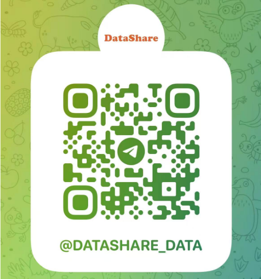

# 资源共享
资源共享，打破会员限制，不定期更新资源

订阅群组：https://t.me/datashare_data

# 资源列表

## 电子书
|  资源名称   | 链接  |
|  ----  | ----  |
| Python  | https://pan.quark.cn/s/f8653098c1d4 |
|  Rust | https://pan.quark.cn/s/bc8aa780659e |
|  数据分析 | https://pan.quark.cn/s/19e1f9dae6c0 |
|  数学 | https://pan.quark.cn/s/f194e87e6678 |
|  其他 | https://pan.quark.cn/s/635b67d95c21 |

## 影视
### 电视剧
|  资源名称   | 链接  |
|  ----  | ----  |
| 2025年  | https://pan.quark.cn/s/0ad070502b96 |
|  2026年 | https://pan.quark.cn/s/7543f8f14ea2 |
|历史年份| https://pan.quark.cn/s/0808106b32c2 |

### 电影
|  资源名称   | 链接  |
|  ----  | ----  |
| 2025年  | https://pan.quark.cn/s/3cbba2f5d6a0 |
|  2026年 | https://pan.quark.cn/s/95515bcb4e34 |
|历史年份|https://pan.quark.cn/s/342702d55101|

### 音乐
https://pan.quark.cn/s/03504811c46e

### MV
https://pan.quark.cn/s/2a203dfcee32

## 教学视频
|  资源名称   | 链接  |
|  ----  | ----  |
| Python  | https://pan.quark.cn/s/5ae29330e530 |
| 前端 | https://pan.quark.cn/s/42bdc4596427 |

# 更详细的资源分享
[资源详情](share_detail.md)

